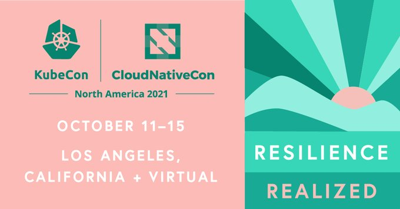

# KubeCon 2021

## Key Themes

- Maturity - Focus seems less on trying to convice people to use Kubernetes. Lots of enterprises in the keynotes giving use cases
- Developer experience - (DevX/devex) is now a top priority, new tools, platforms being built to help developers work with Kubernetes
  - [Kui](https://github.com/kubernetes-sigs/kui)
- Decision criteria for platform build vs buy will get more attention over the next year
- Multi-cloud - Different Kubernetes clusters across different cloud platforms. Seemed to hear more chatter about this again.

## Learning

- <https://learning.kasten.io/> - Saw this in one of the keynotes. Kubernetes training. Labs, Badges, etc

## Sessions

### Microservices Made Easy! - Donovan Brown & Jessica Deen, Microsoft

[Recording](https://kubecon-cloudnativecon-na.com/session-virtual/?v26dd132ae80017cdaf764437c30ebe6f10c1b1eeaab01165e44366654b368dfaeab6baf7e386a642ecb238989334530e=B558B161B31EBE510741D238F9888745D2DACFF2B1F794C8592A2B81400E8D16997F1E1A0DF72A53FD4125FCB6E0A750&fromFollowed)

- [Dapr](https://dapr.io/) really cool micro services framework (service discovery)
- allows for transparent service discovery
- really great presentation and demo

### GitOps+Jenkins-CI With Declarative Everything - Kingdon Barrett, Weaveworks

[Recording](https://kubecon-cloudnativecon-na.com/session-virtual/?v26dd132ae80017cdaf764437c30ebe6f10c1b1eeaab01165e44366654b368dfaeab6baf7e386a642ecb238989334530e=31E9CDCFDF9E48E60443270757B60236E5BF2C043F44DB0F6B59B357313675D0611D02870F1BAC14CFD69BE835979B59&fromFollowed)

- Live session, issue with the demo
- Very fast paced, not great for beginners, little confusing
- Deploy a Jenkins instance with GitOps
- Nice use of helm to install/upgrade Jenkins
- Jenkins pods side channel

### Insights into Unsecured Kubernetes in the Wild - Jay Chen & Aviv Sasson, Palo Alto Networks

[Recording](https://kubecon-cloudnativecon-na.com/session-virtual/?v26dd132ae80017cdaf764437c30ebe6f10c1b1eeaab01165e44366654b368dfaeab6baf7e386a642ecb238989334530e=36C24472F87E7C49E601CC2BA4855F89EC43DBBCDA5C8F64B7C129E17DCD91C6FA27E93068F3808AEEFBA56A8A95CBCF)

- Really great talk, talks about attack vectors for Docker and Kubernetes and how to mitigate them
- API Server overlly permissive default roles and policies lead to a lot of attack vectors if api-server is exposed to the public internet
- Identified 2,100 unsecured Kubernetes clusters in the wild, consisting of 5,300 nodes ~31,340 CPU's
- Discovered malware that exploits Kubelets, replicates itself to mine crypto currency, scans for cloud provider credentials
- Uses Peirates and BOtb (Break out of the box)
- Exploits misconfigured Kubernetes, not a Kubernetes issue

### Shh, It’s a Secret: Managing Your Secrets in a GitOps Way - Jake Wernette & Josh Kayani, IBM

[Recording](https://kubecon-cloudnativecon-na.com/session-virtual/?v26dd132ae80017cdaf764437c30ebe6f10c1b1eeaab01165e44366654b368dfaeab6baf7e386a642ecb238989334530e=E1D25D9BA494683A7282B1022ECC5D7C1EF9A208F33FC2EF1C8B83BFD6F1C6BB50663658D6E29F4FFEF31592DAFED7F0&fromFollowed)

- Argo CD centric. Not really useful to us at the moment.
- New Hashicorp Vault plugin for ArgoCD. Cool concept of how to mangage secrets.

### How We Built a Cloud On K3s: The Learnings Of Growing Up Fast - Alex Jones & Anaïs Urlichs, Civo

[Recording](https://kubecon-cloudnativecon-na.com/session-virtual/?v26dd132ae80017cdaf764437c30ebe6f10c1b1eeaab01165e44366654b368dfaeab6baf7e386a642ecb238989334530e=A17D1050FB73DAC88560D379A68DF88D36D0A27DF4081FD40997134134E7E21CDE9038902034FDA4B7DD3F2E4ED56109&fromFollowed)

- Civo, K3's at production scale (crazy since K3's is only like 2 years old)
- Cloud native first
- Single binary install, 512mb of RAM. Can run on a Raspberry Pi
- Super multi-tenant cluster. Using libvirt to launch VM inside a pod
